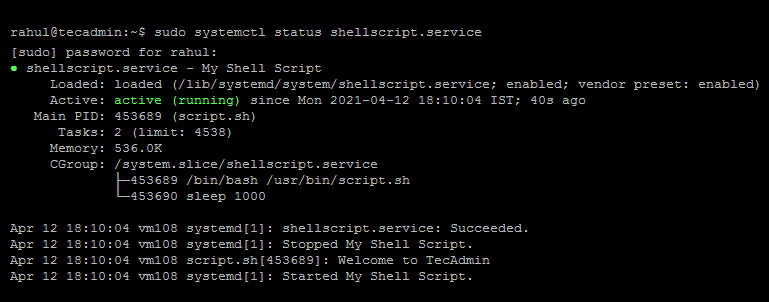

## Actividad 4

### Paso 1
Crear un script que muestre un saludo y la fecha por consola en el directorio ***"/usr/bin/"***.

Nombre del script: **script.sh**

Contenido del script:
~~~
#!/bin/bash

echo "Saludos desde la shell de Linux"

fecha="$(date +%Y-%m-%d)"

echo "$fecha"
~~~

Otorgar permisos de ejecución al script con el comando:
~~~
$ sudo chmod +x /usr/bin/script.sh
~~~

### Paso 2
Crear un archivo de unit service para el systemd en el sistema. Este debe tener la extensión .service y debe ser guardado en el directorio ***/lib/systemd/system/***.

Nombre del archivo: **shellscript.service**

Contenido del archivo:
~~~
[Unit]
Description=Actividad 4 SO1

[Service]
ExecStart=/usr/bin/script.sh

[Install]
WantedBy=multi-user.target
~~~

### Paso 3
El paso 3 es habilitar el nuevo servicio. En este momento el servicio de sistema se ha agregado al servicio. Se tiene que recargar el _systemctl daemon_ para que se pueda leer el nuevo archivo.

~~~
$ sudo systemctl daemon-reload 
~~~

Ahora se habilita el servicio para que se inicie en el arranque del sistema, y también iniciar el servicio con los siguientes comandos:
~~~
$ sudo systemctl enable shellscript.service
$ sudo systemctl start shellscript.service 
~~~

Finalmente se verifica que el script este levantado y ejecutando como un systemd service.
~~~
$ sudo systemctl status shellscript.service 
~~~

El resultado debe ser similar a este:

    

